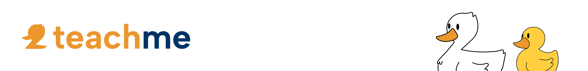

# TeachMe - Plataforma Inteligente de Explicadores 📘👩‍🏫

  
  
  
  

**TeachMe** é uma plataforma inteligente de explicadores desenvolvida como parte do projeto académico da unidade curricular **Projeto I**.  
O objetivo é apoiar alunos do **primeiro e segundo ciclo** a aprender de forma mais personalizada, acessível e divertida.

> Ensinar com atenção. Aprender com motivação.

---

## ✨ Sobre o Projeto

A TeachMe surgiu como resposta à necessidade crescente de ambientes de apoio escolar personalizados e fáceis de usar. O foco está em oferecer uma plataforma que permite aos alunos encontrar explicadores, marcar aulas, interagir através de quizzes e acompanhar o seu progresso educativo com gamificação.

A experiência de aprendizagem é reforçada com funcionalidades de personalização, tanto para alunos como para explicadores, criando um ambiente mais envolvente e motivador.

---

### 🎯 Objetivos Principais

- Ajudar alunos do 1º e 2º ciclo a aprender com explicadores qualificados.
- Tornar o processo de marcação de aulas mais fácil e acessível.
- Incentivar o progresso com elementos de gamificação.
- Permitir que explicadores personalizem os recursos que oferecem.
- Estimular a autonomia e o gosto pelo estudo.

---

## 🚀 Funcionalidades Principais

- **Marcação de Aulas** com explicadores escolhidos pelos próprios alunos.  
- **Personalização de Avatar** e **foto de perfil** para criar uma identidade única.  
- **Documentos de Formação**: explicadores podem partilhar materiais educativos.  
- **Criação de Quizzes**: explicadores podem criar quizzes personalizados para os alunos.  
- **Sistema de Gamificação**: ganhe pontos, suba na leaderboard, responda aos quizzes e personalize seu pato avatar.  

---

## 🛠️ Tecnologias Utilizadas

- **Frontend**: HTML, CSS, JavaScript  
- **Base de Dados**: localStorage  
- **Prototipagem e Design**: Figma, Affinity  
- **Gestão de Projeto**: TeamGant, GitHub Projects  
- **Controlo de Versão**: Git & GitHub

---

## 🌐 Acesso à Plataforma

Acede agora à plataforma online:

🔗 [https://teachme-nine.vercel.app/](https://teachme-nine.vercel.app/)

> Para aceder a todas as funcionalidades, o utilizador deve **criar uma conta** ou **iniciar sessão**.

---

## 📜 Licença

Distribuído sob a Licença MIT. Consulta o ficheiro `LICENSE` para mais informações.

---

## 👥 Equipa de Desenvolvimento

- **Linda Silva** – [GitHub](https://github.com/LindaGlahy)  
- **Miguel Machado** – [GitHub](https://github.com/Miguyy)  
- **Manuel Teixeira** – [GitHub](https://github.com/Manutex78)

---

## 🙏 Agradecimentos

- Escola Superior de Media Artes e Design (ESMAD)  
- Politécnico do Porto (P.PORTO)  
- Prof. Doutor Mário Pinto  
- Prof. Doutor Ricardo Queirós  
- Prof. António Machado  
- [Fontawesome](https://fontawesome.com/) (para iconografia)
